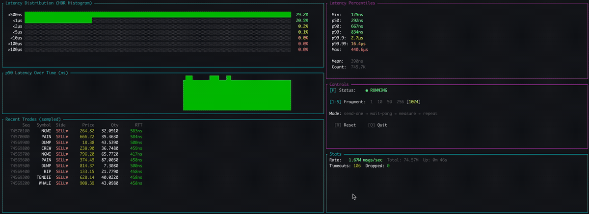
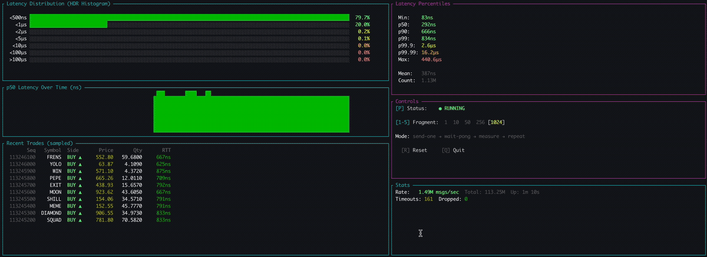
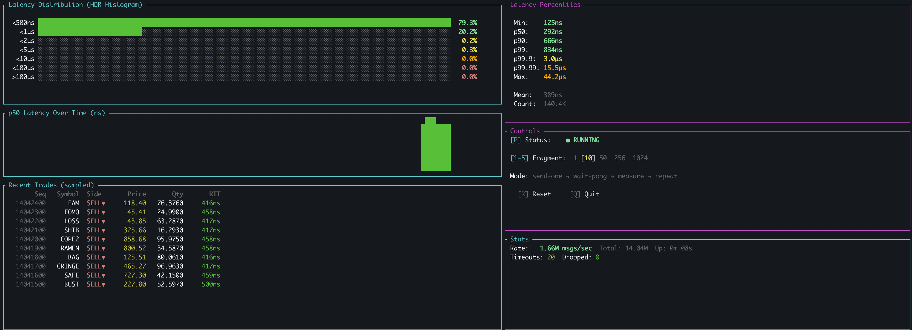
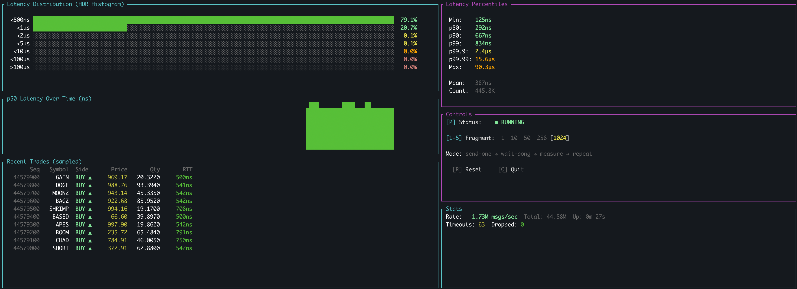
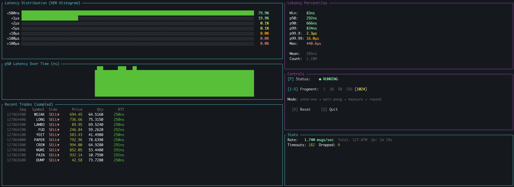

# aeron-ping-pong

> **Part 2 of 3** in the Aeron Low-Latency Series

| # | Project | Focus |
|---|---------|-------|
| 1 | [aeron-ipc-bridge](https://github.com/szabelin/aeron-ipc-bridge) | Throughput, backpressure & cross-language IPC |
| **2** | **aeron-ping-pong** (this repo) | Latency measurement with round-trip benchmarks |
| 3 | *aeron-cluster-dashboard* (coming soon) | Cluster stats dashboard & monitoring |

---

**Sub-microsecond RTT** | **HDR Histogram** | **48-byte market data ping-pong**

Round-trip latency benchmark between Java and Rust using [Aeron](https://github.com/real-logic/aeron) shared memory IPC.

### Live Demo



*Ramp-up phase — ping-pong messages start flowing, HDR histogram builds up, and the p50 latency sparkline stabilizes around 292ns*



*Sustained measurement — 1.74M msgs/sec with sub-microsecond RTT, trades streaming through the echo loop at p50=292ns, p99=834ns*

### Screenshots

| Early measurement (8s) | Ramp-up (27s) |
|:---:|:---:|
|  |  |
| Fragment=10, 1.66M msgs/sec — histogram forming, p50=292ns, max=44μs | Fragment=1024, 1.73M msgs/sec — distribution settling, 445K samples |

| Sustained (1m 19s) |
|:---:|
|  |
| **1.74M msgs/sec** — 1.28M round-trips measured, p50=292ns, p99=834ns, p99.99=16μs, zero dropped messages |

```
┌─────────────────────────────────────────────────────────────────┐
│  LATENCY BENCHMARK                                               │
├─────────────────────────────────────────────────────────────────┤
│  Method:       Ping-pong (Java → Rust → Java)                  │
│  Message:      48 bytes (real market data, cache-line aligned)  │
│  Histogram:    HDR Histogram (3 significant digits)             │
│  Warmup:       100,000 messages (JIT + cache stabilization)     │
│  Measurement:  1,000,000 messages                               │
│  Transport:    Shared memory IPC (no syscalls, no kernel)       │
│                                                                  │
│  Throughput measurement → Part 1: aeron-ipc-bridge        │
└─────────────────────────────────────────────────────────────────┘
```

## Why This Exists

Built to demonstrate hands-on experience with **Aeron IPC**, **sub-microsecond latency measurement**, and **cross-language round-trip benchmarking**.

This project showcases:
- Ping-pong latency measurement between Java and Rust
- HDR Histogram for accurate percentile analysis
- Zero-copy echo for clean RTT measurement
- Busy-spin polling patterns used in HFT

**Java sends market data → Rust echoes raw bytes → Java measures RTT**

## Architecture

```
┌──────────────────┐                      ┌──────────────────┐
│  Java Ping       │                      │  Rust Pong       │
│                  │   market data (48B)  │                  │
│  embed nanoTime  │ ── stream 1001 ───►  │  receive msg     │
│  publish msg     │                      │  echo raw bytes  │
│  wait for echo   │   echo (48B)         │  immediately     │
│  RTT = now-sent  │ ◄── stream 1002 ──  │  (zero processing│
│  record HDR hist │                      │   for clean RTT) │
└──────────────────┘                      └──────────────────┘
        │
   ┌────┴─────────────┐
   │ HDR Histogram     │
   │ p50, p99, p99.9   │
   │ p99.99, min, max  │
   └──────────────────┘
```

## Quick Start

### Prerequisites
- Java 21+
- Rust 1.70+
- Gradle

### Building

```bash
# Java
cd java && ./gradlew build

# Rust
cd rust && cargo build --release
```

### Running Tests

```bash
# Rust (13 tests)
cd rust && cargo test
```

### Running the Benchmark

**Terminal 1 — Start Media Driver:**
```bash
cd java && ./gradlew runMediaDriver
```

**Terminal 2 — Start Rust Pong (echo service):**
```bash
cd rust && cargo run --release --bin pong
```

**Terminal 3 — Run Java Ping (latency benchmark):**
```bash
cd java && ./gradlew runPing
```

The ping will:
1. Warm up with 100K messages (discarded)
2. Measure 1M round-trips with HDR Histogram
3. Print full percentile breakdown

### TUI Latency Monitor (optional)

Watch the pong stream in real-time with the interactive TUI:

```bash
cd rust && cargo run --release --bin tui-latency
```

## How It Works

### Ping (Java)
1. Pre-generates 10K market data messages (zero GC in hot path)
2. Embeds `System.nanoTime()` in the timestamp field
3. Publishes on stream 1001
4. Busy-spins polling stream 1002 for the echo
5. Computes RTT = `System.nanoTime() - embedded_timestamp`
6. Records in HDR Histogram

### Pong (Rust)
1. Subscribes to stream 1001
2. Receives 48-byte message
3. Echoes the **raw bytes** back on stream 1002
4. Zero decoding, zero processing — cleanest possible latency

### Why Raw Echo?
Any processing in the pong adds noise to the RTT measurement. By echoing raw bytes, we measure pure Aeron IPC transport latency + the overhead of one encode + one decode on the Java side. This gives the truest picture of the messaging infrastructure performance.

## Message Format

Same 48-byte market data format as [Part 1](https://github.com/szabelin/aeron-ipc-bridge):

```
[0-7]   timestamp (i64 ns)     ← System.nanoTime() embedded here for RTT
[8-15]  symbol (8B ASCII)
[16-23] price mantissa (i64)
[24-31] qty mantissa (i64)
[32-39] volume mantissa (i64)
[40-42] exponents (3 × i8)
[43]    flags (u8)
[44-47] sequence (u32)
```

## Configuration

| Setting | Value | Notes |
|---------|-------|-------|
| Aeron Directory | `/tmp/aeron-bridge` | Shared with Part 1 |
| Ping Stream | `1001` | Java → Rust |
| Pong Stream | `1002` | Rust → Java |
| Message Size | `48 bytes` | Fits in 64-byte cache line |
| Warmup | `100,000` | Discarded before measurement |
| Measurement | `1,000,000` | Recorded in HDR Histogram |

## Project Structure

```
aeron-ping-pong/
├── java/
│   ├── src/main/java/com/crypto/pingpong/
│   │   ├── PingPong.java              # Ping + HDR histogram measurement
│   │   ├── MarketDataMessage.java     # 48-byte message format
│   │   ├── AeronConfig.java           # Aeron configuration
│   │   └── MediaDriverLauncher.java   # Standalone Media Driver
│   └── build.gradle
├── rust/
│   ├── src/
│   │   ├── lib.rs                     # Shared config & message decoding (13 tests)
│   │   └── bin/
│   │       ├── pong.rs                # Echo service (zero-copy)
│   │       └── tui_latency/           # Interactive latency monitor
│   │           ├── main.rs            #   Entry point & event loop
│   │           ├── state.rs           #   Shared state & data types
│   │           ├── worker.rs          #   Ping-pong measurement thread
│   │           └── render.rs          #   TUI rendering (6 panels)
│   ├── benches/
│   │   └── hot_path.rs               # Criterion microbenchmarks
│   └── Cargo.toml
└── docs/
    └── images/
```

## Dependencies

### Java
- Aeron 1.44.1
- Agrona 1.21.2
- HdrHistogram 2.2.2

### Rust
- rusteron-client 0.1 (Aeron C bindings)
- hdrhistogram 7.5 (latency recording)
- quanta 0.12 (fast monotonic clock via TSC)
- ratatui 0.28 + crossterm 0.28 (TUI)
- criterion 0.5 (microbenchmarks, dev-only)

## Platform Requirements

- **Architecture**: x86-64 or ARM64 (little-endian)
- **OS**: macOS, Linux
- **Java**: 21+
- **Rust**: 1.70+

**Note**: Uses native byte order (little-endian). Big-endian architectures are not supported.

## Microbenchmarks (Criterion)

Hot-path operations benchmarked with [Criterion.rs](https://github.com/bheisler/criterion.rs) in release mode:

```bash
cd rust && cargo bench
```

Results on Apple M-series (ARM64):

| Operation | Time | What it measures                                                              |
|---|---|-------------------------------------------------------------------------------|
| `encode_timestamp` | 223 ps | Single 8-byte LE write into message buffer                                    |
| `encode_full_message` | 430 ps | All 48 bytes: timestamp + symbol + prices + flags                             |
| `decode_all_fields` | 11.4 ns | Decode timestamp, symbol (UTF-8), price, qty, flags                           |
| `histogram_record` | 4.3 ns | HDR Histogram bucket lookup + counter increment                               |
| `histogram_record_corrected` | 6.9 ns | Same + coordinated omission phantom samples                                   |
| `std::Instant::now` | 25.3 ns | clock_gettime(CLOCK_MONOTONIC) syscall |
| `quanta::Clock::now` | 12.3 ns | TSC read — **2x faster**, used in hot path |

The clock call was the most expensive operation in the measurement loop. Switching from `std::time::Instant` to [quanta](https://github.com/metrics-rs/quanta) in the worker thread saves ~13ns per round-trip by reading the CPU timestamp counter (TSC) directly instead of going through `clock_gettime`. Still monotonic, still immune to NTP/wall-clock drift.

HTML reports with confidence intervals and regression detection: `rust/target/criterion/report/index.html`

## Benchmark Environment

Results shown in screenshots were measured on:
- **CPU**: Apple M-series (ARM64), single machine
- **Transport**: Aeron IPC (shared memory, no network)
- **JVM**: OpenJDK 21, default flags + `--add-opens` for Aeron/Agrona
- **Rust**: release build with default optimizations (`cargo build --release`)

Latency numbers will vary by hardware. The relative distribution (p50 vs p99 vs tail) is more meaningful than absolute values.

## Troubleshooting

**Messages not arriving:**
1. Verify Media Driver is running: check `/tmp/aeron-bridge` exists
2. Restart in order: Media Driver → Pong → Ping
3. Check for firewall/permissions blocking shared memory

**RTT values seem too high:**
- Ensure `--release` build for Rust pong (debug builds add significant overhead)
- Check no other processes are competing for CPU cores
- Verify warmup phase completes before interpreting results

**Corrupted values (e.g., price shows 1.23e+15):**
- Likely byte order mismatch — ensure both Java and Rust use little-endian
- Verify MESSAGE_SIZE matches (48 bytes)

## License

See LICENSE file.

---

## Acknowledgments

Built with assistance from [llm-consensus-rs](https://github.com/szabelin/llm-consensus-rs) — a Rust-based LLM consensus server for code review and validation.
